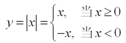
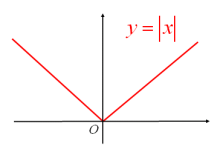
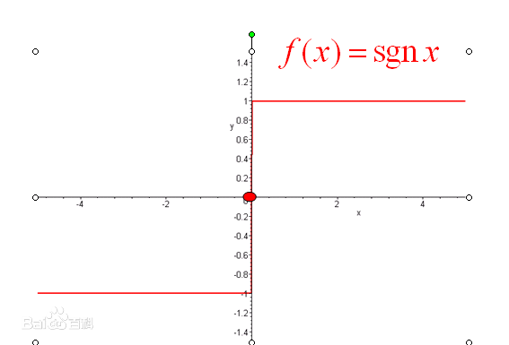
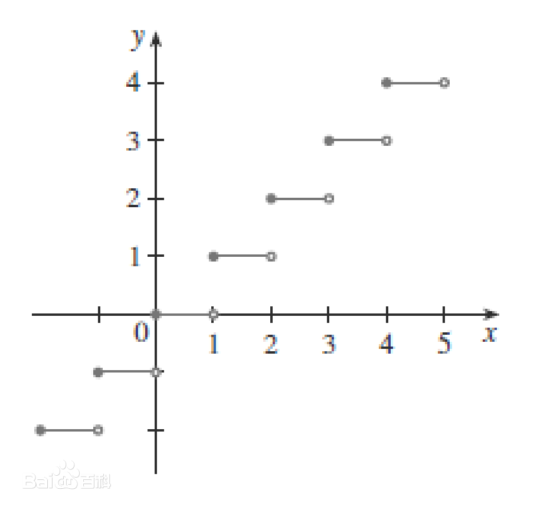
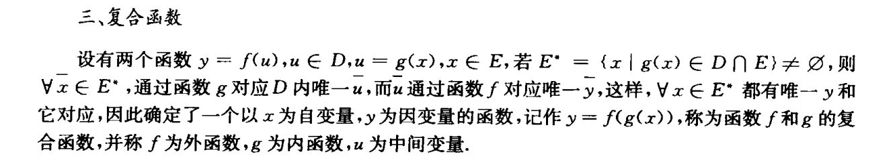
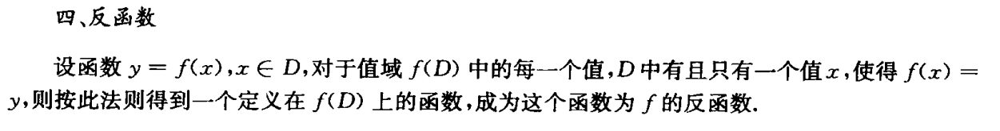
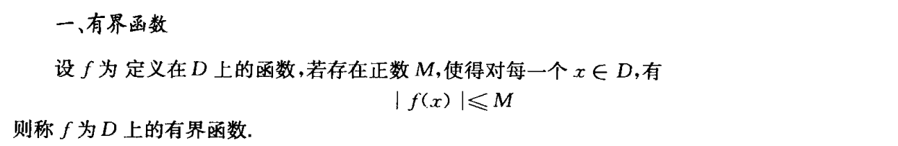
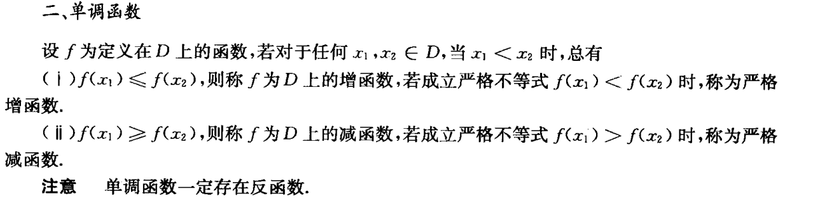
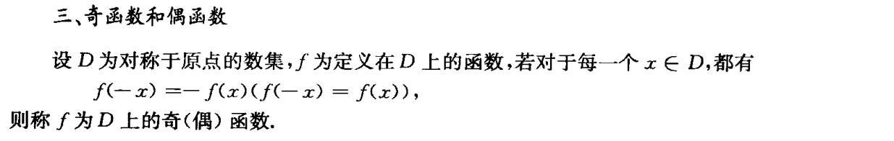
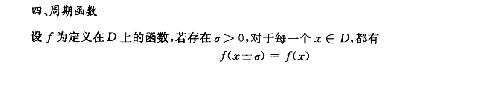

函数的概念及特征

## 函数的定义

**定义1** 

给定两个实数集$D$和$M$，若有对应法则$f$，使对$D$内的每一个数$x$，都有唯一一个数$y\in M$与它对应，则称$f$是定义在数集$D$上的函数。记作
$$
f:D \rightarrow M
$$
数集$D$称为函数$f$的**定义域**。$x$所对应的数$y$称为$f$在点$x$的**函数值**，常记为$f(x)$。全体函数值的集合$f(D)=\{y|y=f(x),x\in D\} (\subset M)$  称为函数$f$的**值域**。

$D\rightarrow M$表示按着法则$f$建立数集$D$到$M$的**函数关系**。习惯上，我们称此函数关系中的$x$为**自变量**，$y$为**因变量**。

## 函数的表示

- 公式法
- 列表法
- 图像法

### 绝对值函数

**图像**

### 符号函数

$$
sgn \  x=   
\begin{cases}
		&1   &x>0 \\
		&0   &x=0 \\
		&-1  &x<0\\
\end{cases}

$$

定义域为$D=(-\infin,+\infin)$，值域$R_f=\{-1,0,1\}$

$x=sgnx * |x|$

**图像**

### 取整函数

设$x$为任一实数，不超过$x$的最大整数称为$x$的整数部分，记作$[x]$。

把$x$看做变量，则函数$y=[x]$ ，称为取整函数。

定义域为$D=(-\infin,+\infin)$，值域$R_f=Z$

图像

### 狄利克雷函数

### 黎曼函数

## 复合函数

复合函数也可以由多个函数相继复合而成

当且仅当$E^*(\{x|g(x)\in D\}\bigcap E) \neq \emptyset$，函数$f$与$g$才能复合而成。

## 反函数

函数$f$有反函数，意味着$f$是$D$与$f(D)$之间的一个一一映射。

## 函数的特征

### 有界性

### 单调性

### 奇偶性

### 周期性

