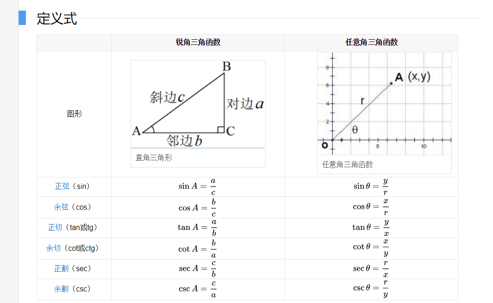
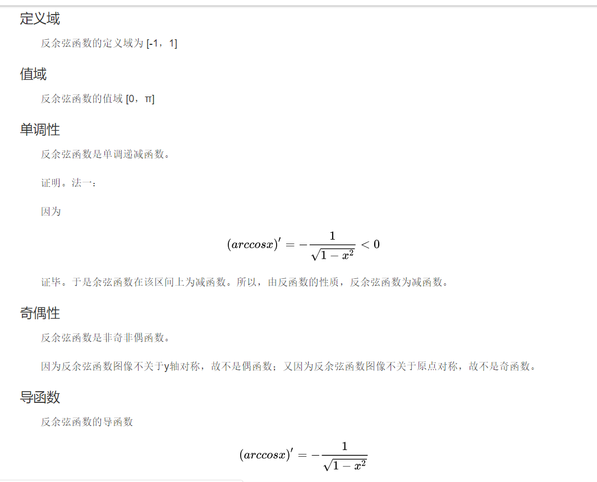

# 基本初等函数

- 常量函数  $y=c(c是常数)$；

- 幂函数 $y=x^a  (a为常数)$；

- 指数函数 $y=a^x(a>0,a \neq 1)$

- 对数函数 $y=log_ax(a>0,a\neq1)$

- 三角函数

  $y=sinx(正弦函数)$，$y=cosx(余弦函数)$，

  $y=tanx(正切函数)$，$y=cotx(余切函数)$

- 反三角函数

  $y=arsinx(反正弦函数)$，$y=arcosx(反余弦函数)$，

  $y=artanx(反正切函数)$，$y=arcotx(反余切函数)$

## 指数运算

对于所有实数$a>0,m,n$，我们有以下恒等式
$$
\begin{aligned}
		a^0&=1		\\
		a^1&=a		\\
	a^(-1)&=1/a		\\
	(a^m)^n&=a^{mn}=(a^n)^m \\
	a^ma^n&=a^{m+n}
\end{aligned}	\\
对于所有n和a\geq 1,函数a^n关于n单调递增。\\
$$
我们假定$0^0=1$

**多项式与指数的增长率比较**
$$
\begin{aligned}
对所有使得a>1的实常量a和b,有 \\
&\lim_{n\rightarrow \infty} \frac{n^b}{a^n}=0 \\
因此可得 \\
&n^b=o(a^n)
\end{aligned}
$$
**自然对数$e$**
$$
对于所有实数x,我们有 \\
e^x=1+x+\frac{x^2}{2!}+\frac{x^3}{3!}+\cdots=\sum^{\infty}_{i=0}\frac{x^i}{i!}
$$

$$
对所有实数x，我们有不等式 \\
e^x\geq 1+x ,只有x=0时等号成立 \\
当 |x|\leq 1时，有近似估计 \\
1+x+x^2 \geq e^x \geq1+x 
$$

$$
对所有x，我们有： \\
\lim_{n\rightarrow \infty} (1+\frac{x}{n})^n=e^x
$$

## 对数运算

我们将使用以下记号：

 $lgn= log_2n   \tag{以2为底的对数} $

​	$ lnn\tag{自然对数} \\$

​	$ lg^kn=(lgn)^k\tag{取幂} \\$

​	$ lglgn=lg(lgn)\tag{复合} \\$

对所有实数$a>0,b>0.c>0和m,n$，有
$$
\begin{aligned}
		a&=b^{log_ba}		\\
		log_c(ab)&=log_ca+log_cb		\\
	log_ba^n&=nlog_ba		\\
	log_ba&=\frac{log_ca}{log_cb} \\
	log_b(1/a)&=-log_ba \\
	log_ba&=\frac{1}{log_ab}\\
	a^{log_bc}&=c^{log_ba}
\end{aligned}	\\
其中，在上面的每个等式中，对数的底不为1\\
$$

## 阶乘

记号$n!$（读作$n$的阶乘）定义为对整数$n\geq 0$，有
$$
n!= \{ \begin{aligned}
		&1   &若n=0 \\
		&n*(n-1)	&若n>0
\end{aligned} \\
n!=1*2*3*\cdots n
$$

## 指数函数与对数函数图像

.jpg)

## 三角函数运算

定义

函数关系

## 三角函数图像

tan:

arctan

## arcsin

## arccos

## arctan

